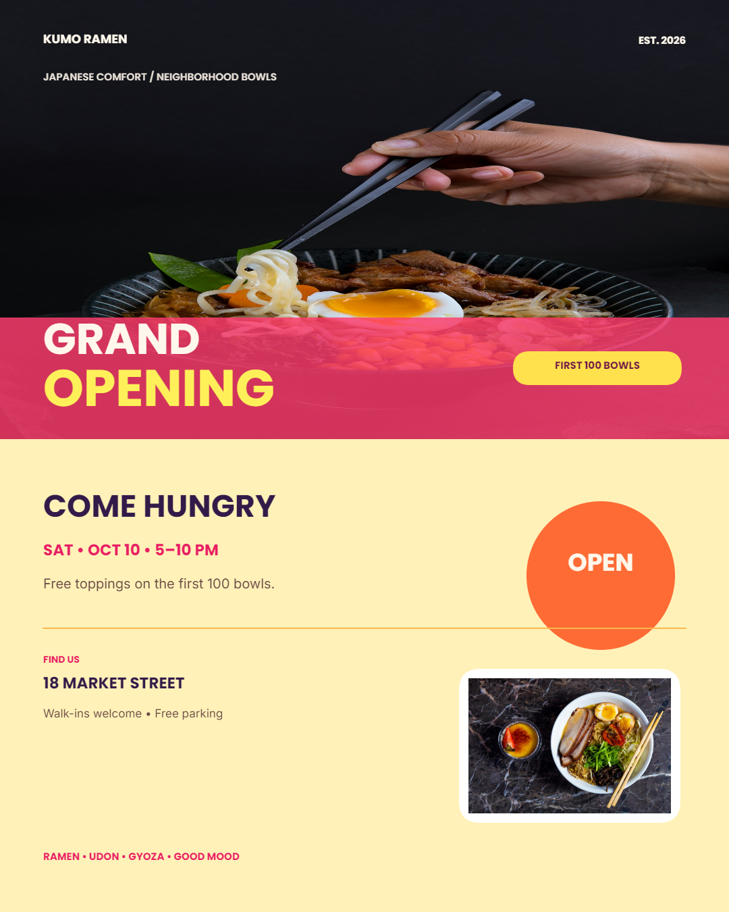
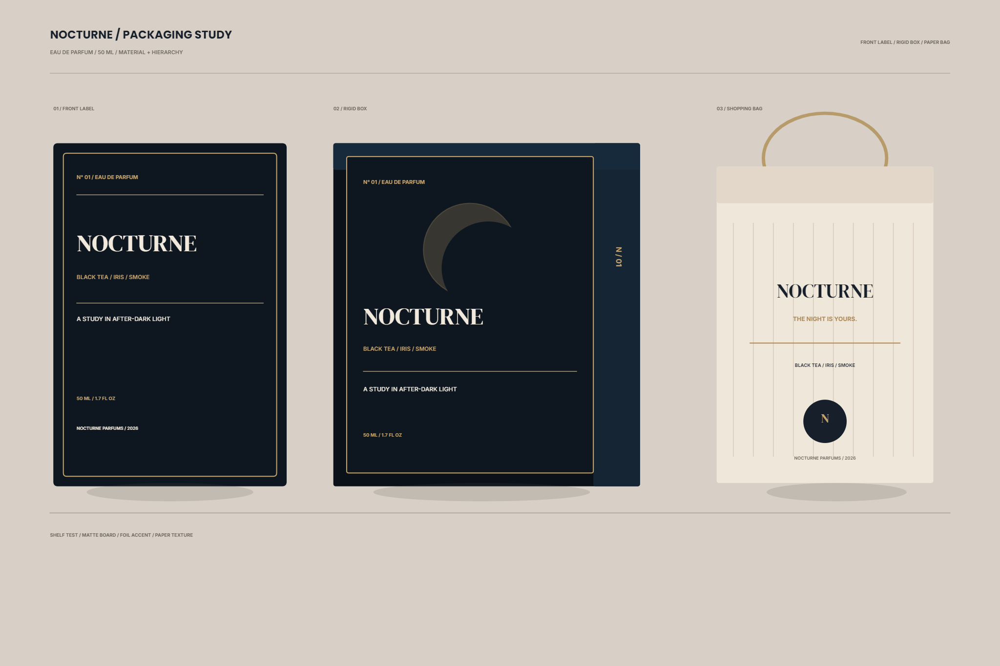
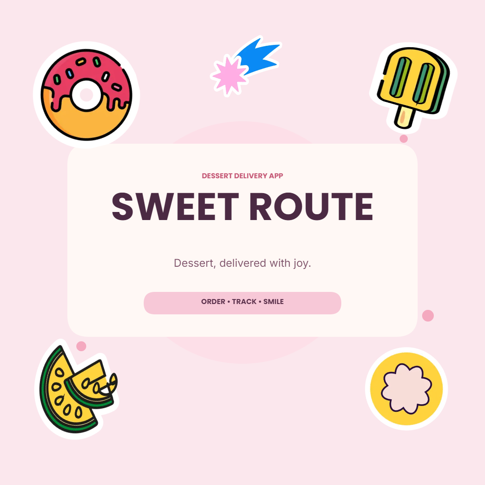

<p align="center">
  
</p>

<h1 align="center">Avnac Studio</h1>

<p align="center">
  The native desktop version of <a href="https://github.com/akinloluwami/avnac">Avnac</a>, a design canvas for layouts, posters, social graphics, and visual documents.
</p>

<p align="center">
  <a href="https://github.com/striker561">
    
  </a>
  &nbsp;&nbsp;
  <a href="https://github.com/d3uceY">
    
  </a>
  <br />
  <sub><b>Desktop port maintained by <a href="https://github.com/striker561">striker561</a> &amp; <a href="https://github.com/d3uceY">d3uceY</a></b></sub>
</p>

<p align="center">
  <a href="./LICENSE">MIT License</a>
</p>

Designed on the browser, openly now built for desktop.


## ⬇️ Download

<a href="https://github.com/striker561/Avnac-Studio/releases/latest"></a>

### 🪟 Windows

[](https://github.com/striker561/Avnac-Studio/releases/latest/download/avnac-studio-windows-amd64-installer.exe)

### 🍎 macOS

[](https://github.com/striker561/Avnac-Studio/releases/latest/download/avnac-studio-macos-arm64.dmg)

[](https://github.com/striker561/Avnac-Studio/releases/latest/download/avnac-studio-macos-amd64.dmg)

### 🐧 Linux

[](https://github.com/striker561/Avnac-Studio/releases/latest/download/avnac-studio-linux-amd64)

---

> **Upstream Notice:** The `main` branch of this repository is a mirror of the original web app by [@akinloluwami](https://github.com/akinloluwami) at [akinloluwami/avnac](https://github.com/akinloluwami/avnac). All desktop-specific work lives on the **`studio`** branch, which is the default branch of this fork.

---

## Why the Desktop Version?

Avnac Studio is a native desktop app built with [Wails](https://wails.io/) + Go. It is not a browser tab, and it is not Electron.

|                     | Avnac Studio (desktop)                  | Avnac (web)                              |
| ------------------- | --------------------------------------- | ---------------------------------------- |
| **Runtime**         | Native Wails + Go binary                | Browser / Node backend                   |
| **Memory usage**    | Very low - no Chromium process overhead | Browser-dependent                        |
| **Executable size** | Lightweight single binary               | N/A (web app)                            |
| **File storage**    | Native OS app data directory            | IndexedDB (browser storage)              |
| **Media proxy**     | Built directly into the app binary      | Separate backend service                 |
| **HTTP backend**    | None required                           | Elysia backend for media, Unsplash, auth |
| **Startup time**    | Fast - no cold boot of a server         | Depends on backend startup               |
| **Offline use**     | Fully offline after install             | Partial                                  |
| **Export**          | Native file save dialogs                | Browser download                         |

In short: Avnac Studio starts fast, uses very little memory, ships as a light executable, needs no running HTTP backend, and persists your files to the OS natively - not to your browser.

---

## What the App Can Do

### Create and manage files

- Create canvases from presets or custom dimensions
- Manage files from the Files screen - open, duplicate, rename, delete, import, and download workspace data
- Autosave to native app storage on every change - no manual saving required

<!-- screenshot: files screen showing file grid and management actions -->


---

### Full canvas editor

- Edit text, shapes (rectangles, ellipses, polygons, stars), lines, and arrows directly on the canvas
- Add and crop images from local uploads or Unsplash
- Remove image backgrounds with one click
- Multi-select, group/ungroup, reorder layers, and align objects
- Resize, rotate, and position elements with precision controls

<!-- screenshot: canvas editor with a poster layout open -->


---

### Layers, styling, and effects

- Full layer panel with visibility and ordering controls
- Background fill - solid, gradient, or image
- Blur, opacity, corner radius, and shadow controls per element
- Stroke and paint popover controls
- Text formatting: font family (including Google Fonts), size, weight, alignment

<!-- screenshot: layer panel and element styling controls -->


---

### Multi-page workspaces

- Build documents across multiple pages in a single workspace
- Per-page state is stored independently in native storage
- Import and export individual pages or entire workspaces as portable files

<!-- screenshot: multi-page workspace with page tabs -->


---

### Vector boards

- Embed nested vector-board drawing areas inside your canvas
- Vector boards are independently editable and stored separately from the main document
- Useful for components, reusable elements, or isolated drawing zones

<!-- screenshot: vector board panel and embedded vector board on canvas -->


---

### Export

- Export canvases as PNG with scale and transparency options
- Native file save dialog - exports go directly to your filesystem
- Export workspace or page data as portable JSON files


---

## 🤖 Let AI Agents Design — Built-in MCP Server

Avnac Studio ships with a built-in [Model Context Protocol](https://modelcontextprotocol.io) server. While the app is running, any MCP client — Cursor, Claude Desktop, Windsurf, MCPJam Inspector, and more — can create, inspect, and edit designs on your canvas in real time.

Every design below was created end-to-end by an AI agent driving Avnac Studio through MCP.

| Event flyer | Packaging study | App splash |
| --- | --- | --- |
|  |  |  |

The flyer pulls photos from Unsplash; the packaging study and splash use shapes, text, and built-in stickers — all rendered by the same Saraswati engine you drive by hand.

### Connecting an agent

The server starts automatically with the app — nothing to configure inside Avnac Studio. With the app open, point your MCP client at one of:

| Transport | URL | Best for |
| --- | --- | --- |
| **Streamable HTTP** (recommended) | `http://localhost:12345/` | Cursor, MCPJam, modern MCP clients |
| SSE (legacy) | `http://localhost:12345/sse` | Claude Desktop and SSE-only clients |

**Cursor** — add to `.cursor/mcp.json` (or project `.cursor/mcp.json`):

```json
{
  "mcpServers": {
    "avnac-studio": {
      "url": "http://localhost:12345/"
    }
  }
}
```

**Claude Desktop** — add to `claude_desktop_config.json`:

```json
{
  "mcpServers": {
    "avnac-studio": {
      "url": "http://localhost:12345/sse"
    }
  }
}
```

> Tip: open `http://localhost:12345/` in any browser to confirm the server is up before connecting a client.

### What agents can do — 27 tools

- **Files** — `list_files`, `open_canvas`, `rename_file` (work even with no canvas open)
- **Canvas setup** — `create_canvas` (size, background, name), `apply_artboard_preset` (IG, HD, A4…), `set_background`, `clear_canvas`, `get_canvas_summary`
- **Create & edit** — `render_elements` creates rects, ellipses, polygons, stars, lines, text, images, and stickers in one call (solid or gradient paints); `modify_elements`, `delete_object`, `group_objects` / `ungroup_objects`
- **Layout** — `align_objects`, `distribute_objects`, `fit_to_artboard`
- **Assets** — `search_unsplash`, `list_stickers`, `get_font_list` (Google Fonts)
- **Verify & export** — `get_canvas_image` (screenshot so the agent can visually check its own work), `get_object_properties`, `export_png`, `export_object`

Three ready-made workflows ship as MCP prompts: **`design-graphic`** (write a brief → render → screenshot audit → verify against the request), **`edit-canvas`** (diff-oriented edits on the open design), and **`design-audit`** (critique + fix the most impactful issues).

### Try it

With the app open, tell your agent:

> Design a grand-opening flyer for a ramen shop — 1080×1350, bold Japanese comfort-food energy, appetizing photography.

The agent creates the canvas, pulls photography from Unsplash, renders typography and shapes, screenshots the artboard to review itself, and exports the final PNG — all through the protocol.

Full tool reference, prompt details, and client-by-client setup: [`docs/MCP_GUIDE.md`](docs/MCP_GUIDE.md) · [`docs/MCP_TEST_PROMPTS.md`](docs/MCP_TEST_PROMPTS.md).

---

## What's Different from the Web App

The original [Avnac web app](https://github.com/akinloluwami/avnac) is a browser-first editor. Avnac Studio is a ground-up desktop port of that product. Here is what changed:

- **No separate backend.** The web app uses an Elysia/TypeScript backend for media proxying, Unsplash, and documents. In Avnac Studio, all of that is handled inside the Go runtime - the media proxy, Unsplash integration, and file IO are part of the app binary itself.
- **Native file storage.** The web app stores documents in IndexedDB. Avnac Studio writes to the OS app data directory using a structured per-workspace folder layout. Files survive browser resets and profile wipes.
- **One-time browser storage migration.** On first run after switching to native storage, the app migrates any existing browser-local documents so nothing is lost.
- **Native export dialogs.** Exporting in the web app triggers a browser download. Avnac Studio opens a native OS save dialog.
- **No Node or Deno process.** The entire backend surface is a Go binary. There is no npm service to run, no port to remember, no server to restart.
- **Lightweight.** The compiled binary is small. There is no bundled Chromium (unlike Electron). The app uses the system webview.

---

## Tech Stack

- **Frontend:** React, Vite, TypeScript, Tailwind CSS, TanStack Router
- **Desktop runtime:** Wails v2 + Go
- **Canvas/runtime engine:** Saraswati (Canvas2D renderer) under `frontend/src/lib/saraswati/`
- **AI UI/runtime:** `@tambo-ai/react`

---

## Saraswati Engine

Avnac Studio runs on Saraswati, a renderer-agnostic 2D scene engine.

Fabric has been sunset and removed from the active editor runtime. Saraswati now owns document structure, commands, interaction translation, and rendering intent.

Current Saraswati slice:

- strict scene graph and scene validation
- pure command reducer
- render-command pipeline
- Canvas2D renderer in the active editor path
- deterministic interaction math and bounds system
- workspace integration across files, pages, and vector boards

Important boundary:

- Saraswati state remains renderer-independent
- render backends consume commands but do not own scene truth
- UI surfaces dispatch commands instead of mutating scene objects directly

Expected impact so far:

- predictable undo/redo and state transitions through command reduction
- lower runtime coupling between editor logic and rendering implementation
- safer long-term renderer replacement because scene and command logic are separated from backend details

Formal benchmarks are not published yet, but the architecture is now in place as the primary runtime path.

Detailed design and rules live in [docs/saraswati-engine.md](./docs/saraswati-engine.md).

If you are interested in the architecture rationale and migration details, read [docs/saraswati-architecture-decisions.md](./docs/saraswati-architecture-decisions.md).

---

## Project Structure

```text
frontend/       React UI, editor, routes, native client wrappers
avnac-system/   Go services for config, IO, workspace storage, and media proxy
app.go          Wails app bootstrap and service wiring
main.go         Wails runtime setup and bindings
```

---

## Native Workspace Storage

Each file gets a dedicated folder in the OS app config directory:

```text
<UserConfigDir>/avnac-studio/documents/<workspace-id>/
  meta.json
  document.json
  pages.json
  vector-boards.json
  vector-board-docs.json
```

- `meta.json` powers the Files list quickly without loading full canvas data
- `document.json` stores the main Saraswati document payload
- `pages.json` stores page-level workspace state
- `vector-boards.json` and `vector-board-docs.json` store vector board state

---

## Development

### Prerequisites

- Go (compatible with this repo's `go.mod`)
- Node.js 22 + npm 10
- Wails CLI v2

If you use `nvm`, this repo includes `.nvmrc`, so run `nvm use` before installing frontend dependencies.

```bash
go install github.com/wailsapp/wails/v2/cmd/wails@latest
wails doctor
```

### Desktop App (Recommended)

```bash
cd frontend
npm ci
cd ..
wails dev
```

### Frontend Only (UI work)

```bash
cd frontend
npm ci
npm run dev
```

Vite runs at `http://localhost:3300`. Native features (file storage, export dialogs, Unsplash config) require the full Wails runtime.

### Contributor Note: Dependency Installs

- Day-to-day setup and CI/CD use `npm ci`, not `npm install`.
- `npm ci` installs exactly what is in `frontend/package-lock.json` and fails if the lockfile and `frontend/package.json` are out of sync.
- Use `npm install` only when you are intentionally adding, removing, or updating dependencies.
- If dependency metadata changes, commit `frontend/package.json` and `frontend/package-lock.json` together in the same commit.
- If `frontend/package-lock.json` changed accidentally, revert it before pushing. CI and release builds rely on it being clean and deterministic.

### Production Build

```bash
wails build
```

Build output goes to `build/bin/`.

---

## Useful Commands

**Frontend:**

```bash
cd frontend
npm run dev
npm run build
npm run test          # all unit + feature tests
npm run test:unit
npm run test:features
npm exec tsc -- --noEmit --pretty false
```

**Go:**

```bash
go test ./...
go build ./...
```

---

## Where To Work

| Area                                      | Path                          |
| ----------------------------------------- | ----------------------------- |
| Editor UI and behavior                    | `frontend/src/components/`    |
| Routes and navigation                     | `frontend/src/routes/`        |
| Frontend storage and document logic       | `frontend/src/lib/`           |
| Saraswati engine and renderer migration   | `frontend/src/lib/saraswati/` |
| Native IO, config, and workspace services | `avnac-system/`               |

---

## Port Maintainers

This desktop port is maintained by:

<table>
  <tr>
    <td align="center">
      <a href="https://github.com/striker561">
        <br />
        <b>striker561</b>
      </a>
    </td>
    <td align="center">
      <a href="https://github.com/d3uceY">
        <br />
        <b>d3uceY</b>
      </a>
    </td>
  </tr>
</table>

---

## Credits

Original Avnac web app created by [@akinloluwami](https://github.com/akinloluwami).
Source: [github.com/akinloluwami/avnac](https://github.com/akinloluwami/avnac)

---

## License

[GPL](./LICENSE) © 2026 striker561, d3uceY
